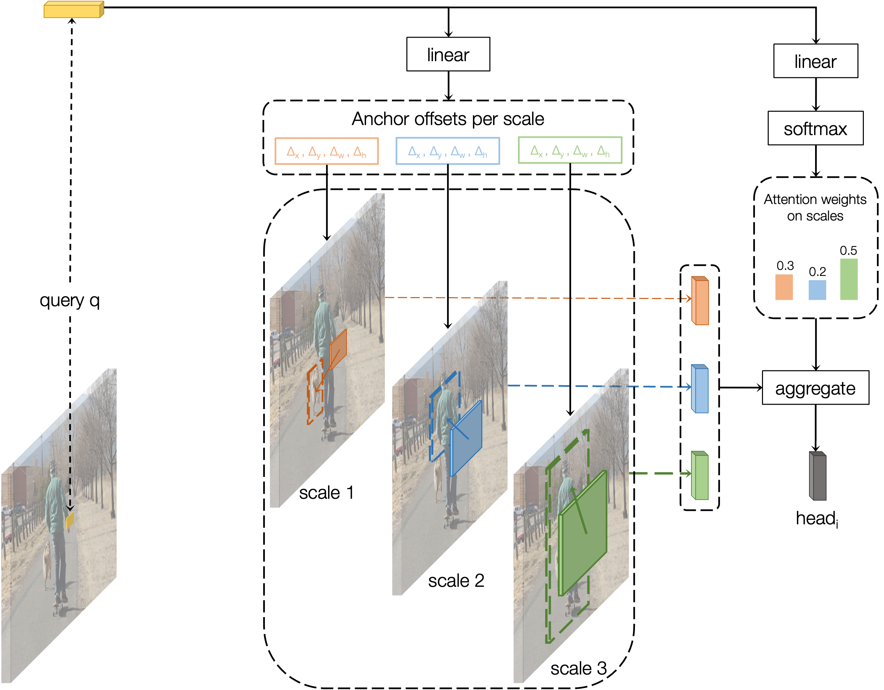
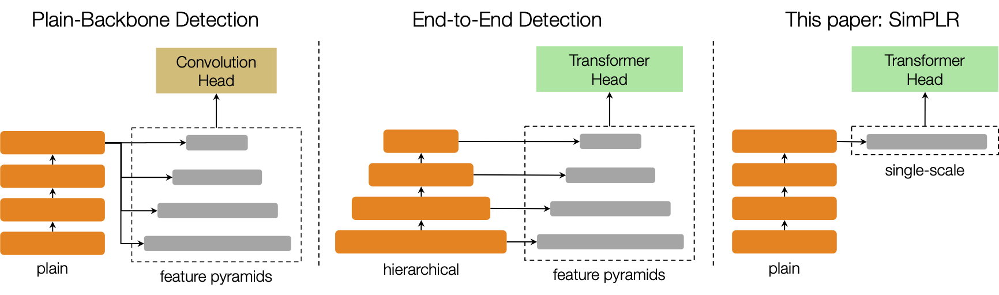

# BoxeR

By [Duy-Kien Nguyen](https://scholar.google.com/citations?user=welhhBIAAAAJ&hl=en), Jihong Ju, Olaf Booij, [Martin R. Oswald](https://scholar.google.de/citations?user=biytQP8AAAAJ&hl=en), [Cees Snoek](https://www.ceessnoek.info/).

This repository is an official implementation of the paper [SimPLR: A Simple and Plain Transformer for Scaling-Efficient Object Detection and Segmentation](https://openreview.net/forum?id=6LO1y8ZE0F).

We also provide the implementation of a strong baseline, DeformableDETR + ViT in our repo.

## Introduction

**TL; DR.** SimPLR is a plain architecture which learns multi-scale information in its attention computation.

<!--  -->



## License

This project is released under the [Apache 2.0 license](./LICENSE).


## Citing BoxeR
If you find BoxeR useful in your research, please consider citing:
```bibtex
@article{nguyen2025simplr,
  title={SimPLR: A Simple and Plain Transformer for Efficient Object Detection and Segmentation},
  author={Duy{-}Kien Nguyen and Jihong Ju and Olaf Booij and Martin R. Oswald and Cees G. M. Snoek},
  journal={arXiv preprint arXiv:2310.05920},
  year={2025}
}
```


## Installation

### Requirements

* Linux, CUDA>=11, GCC>=5.4
  
* Python>=3.8

    We recommend you to use Anaconda to create a conda environment:
    ```bash
    conda create -n boxer python=3.8
    ```
    Then, activate the environment:
    ```bash
    conda activate boxer
    ```
  
* PyTorch>=2.0, torchvision>=0.11.2 (following instructions [here](https://pytorch.org/))

    For example, you could install pytorch and torchvision as following:
    ```bash
    conda install pytorch torchvision torchaudio cudatoolkit=11.3 -c pytorch
    ```
  
* Other requirements & Compilation
    ```bash
    pip install -e ./
    ```

## Usage

### Dataset preparation

The datasets are assumed to exist in a directory specified by the environment variable $E2E_DATASETS.
If the environment variable is not specified, it will be set to be ```.data```.
Under this directory, detectron2 will look for datasets in the structure described below.

For COCO Detection and Instance Segmentation, please download [COCO 2017 dataset](https://cocodataset.org/) and organize them as following:

```
$E2E_DATASETS/
└── coco/
	├── annotation/
		├── instances_train2017.json
		├── instances_val2017.json
		└── image_info_test-dev2017.json
	├── image/
		├── train2017/
		├── val2017/
		└── test2017/
	└── vocabs/
		└── coco_categories.txt - the mapping from coco categories to indices.
```
You can download ```coco_categories.txt``` [here](https).

### Training
Our script is able to automatically detect the number of available gpus on a single node.
It works best with Slurm system when it can auto-detect the number of available gpus along with nodes.
The command for training BoxeR is simple as following:

```bash
python tools/run.py --config ${CONFIG_PATH} --model ${MODEL_TYPE} --task ${TASK_TYPE}
```

For example,

* COCO Detection

```bash
python tools/run.py --config e2edet/config/COCO-Detection/deformable_detr_vit_b_w16_4g_5x_lsj.yaml --model deformable_detr_vit --task detection
```

* COCO Instance Segmentation

```bash
python tools/run.py --config e2edet/config/COCO-InstanceSegmentation/base_simplr_vit_detection.yaml --model simplr --task detection
```


#### Some tips to speed-up training
* If your file system is slow to read images but your memory is huge, you may consider enabling 'cache_mode' option to load whole dataset into memory at the beginning of training:

```bash
python tools/run.py --config ${CONFIG_PATH} --model ${MODEL_TYPE} --task ${TASK_TYPE} dataset_config.${TASK_TYPE}.cache_mode=True
```

* If your GPU memory does not fit the batch size, you may consider to use 'iter_per_update' to perform gradient accumulation:

```bash
python tools/run.py --config ${CONFIG_PATH} --model ${MODEL_TYPE} --task ${TASK_TYPE} training.iter_per_update=2
```

* Our code also supports mixed precision training. It is recommended to use when you GPUs architecture can perform fast FP16 operations:

```bash
python tools/run.py --config ${CONFIG_PATH} --model ${MODEL_TYPE} --task ${TASK_TYPE} training.use_fp16=(float16 or bfloat16)
```
